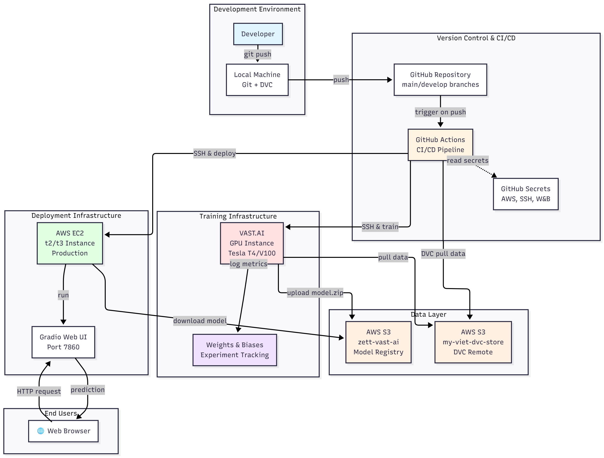

# LLM MLOps Pipeline - Sentiment Analysis

[](https://www.python.org/downloads/)
[](LICENSE)

> **End-to-end MLOps pipeline** cho fine-tuning và deploy mô hình LLM sentiment analysis (IMDb dataset) với automated CI/CD, data versioning (DVC), experiment tracking (W&B), và cloud deployment.

---

## 1. Tổng quan kiến trúc

Dự án triển khai một **production-ready MLOps pipeline** với các thành phần chính:

- **Data Management**: DVC + AWS S3 cho versioning & storage
- **Model Training**: Distributed training trên VAST.AI GPU instances
- **Experiment Tracking**: Weights & Biases (W&B)
- **CI/CD**: GitHub Actions automation
- **Deployment**: AWS EC2 với Gradio web interface
- **Containerization**: Docker multi-stage builds
- **Version Control**: Git + DVC

### Điểm nổi bật

- **Automated Training Pipeline**: Tự động train khi push code
- **Data Versioning**: Track data changes với DVC
- **Scalable Training**: GPU training trên cloud (VAST.AI)
- **Zero-downtime Deployment**: Rolling deployment trên EC2
- **Cost Optimization**: Chỉ sử dụng GPU khi cần
- **Reproducibility**: Đảm bảo kết quả có thể tái tạo

---

## 2. Tech Stack

### Core ML/DL
- **Framework**: PyTorch 2.2.2, Transformers 4.40.2 (Hugging Face)
- **Model**: DistilBERT (distilbert-base-uncased)
- **Dataset**: IMDb Movie Reviews (sentiment analysis)

### MLOps Tools
| Component | Technology | Purpose |
|-----------|-----------|---------|
| **Version Control** | Git, DVC | Code & data versioning |
| **Experiment Tracking** | Weights & Biases | Metrics, parameters, artifacts |
| **CI/CD** | GitHub Actions | Automated pipeline orchestration |
| **Containerization** | Docker | Reproducible environments |
| **Cloud Storage** | AWS S3 | Data lake & model registry |
| **Compute** | VAST.AI (GPU), AWS EC2 (CPU) | Training & inference |
| **Web Interface** | Gradio 3.0.0 | Model serving UI |

### Infrastructure
- **Training**: VAST.AI spot instances (GPU)
- **Deployment**: AWS EC2 (t2/t3 instances)
- **Storage**: AWS S3 buckets
  - `my-viet-dvc-store`: DVC remote storage
  - `zett-vast-ai`: Model artifacts

---

## 3. Kiến trúc hệ thống



### Workflow Steps

1. **Local Development** → Developer pushes code to `develop` branch
2. **GitHub Actions Trigger** → CI/CD pipeline khởi động
3. **Data Validation** → Validate data integrity (schema, labels)
4. **Training on VAST.AI**:
   - SSH to GPU instance
   - Pull latest code & data (DVC)
   - Fine-tune DistilBERT model
   - Upload model artifacts to S3
5. **Deployment to EC2**:
   - SSH to EC2 instance
   - Download model from S3
   - Restart Gradio app với model mới
6. **Production** → Users access web UI

---

## 4. Cấu trúc dự án

```
llm-mlops-pipeline/
│
├── .github/
│   └── workflows/
│       └── ci-cd.yml              # GitHub Actions pipeline definition
│
├── configs/
│   ├── config.yaml                # Default training configuration
│   ├── configA.yaml               # Alternative config A
│   └── configB.yaml               # Alternative config B
│
├── data/
│   ├── export_imdb.py             # Script to export IMDb dataset
│   └── SA/
│       ├── train.csv.dvc          # DVC pointer for training data
│       └── test.csv.dvc           # DVC pointer for test data
│
├── scripts/
│   ├── fine_tune.py               # Main training script
│   └── validate_data.py           # Data validation script
│
├── Dockerfile.train               # Docker image for training
├── Dockerfile.inference           # Docker image for inference (WIP)
├── gradio_app.py                  # Gradio web interface
├── requirements-train.txt         # Training dependencies
├── requirements-infer.txt         # Inference dependencies
├── .dvc/                          # DVC configuration
├── .dvcignore                     # DVC ignore patterns
└── README.md                      # This file
```

---

## 5. Yêu cầu hệ thống

### Local Development
- **OS**: Linux/macOS/Windows (WSL recommended)
- **Python**: 3.9+
- **Git**: 2.30+
- **DVC**: 3.51.0+
- **AWS CLI**: Configured with credentials

### Cloud Resources
- **VAST.AI Account**: GPU instance (Tesla T4/V100/A100)
- **AWS Account**: 
  - S3 buckets (2x)
  - EC2 instance (t2.medium minimum)
- **Weights & Biases**: Free/Pro account

### GitHub Secrets Required
```bash
# AWS Credentials
AWS_ACCESS_KEY_ID
AWS_SECRET_ACCESS_KEY

# VAST.AI SSH
VASTAI_SSH_KEY

# EC2 SSH
EC2_SSH_KEY

# W&B
WANDB_API_KEY
```

### GitHub Variables
```bash
VASTAI_IP      # VAST.AI instance IP
VASTAI_USER    # SSH username
VASTAI_PORT    # SSH port
EC2_IP         # EC2 instance IP
EC2_USER       # SSH username (ubuntu)
```

---

## 6. Cài đặt và Setup

### 1. Clone Repository

```bash
git clone https://github.com/bi6-cat/llm-mlops-pipeline.git
cd llm-mlops-pipeline
```

### 2. Setup Python Environment

```bash
# Create virtual environment
python -m venv venv

# Activate (Linux/macOS)
source venv/bin/activate

# Activate (Windows)
venv\Scripts\activate

# Install dependencies
pip install -r requirements-train.txt
```

### 3. Configure DVC

```bash
# Initialize DVC (if not already)
dvc init

# Add S3 remote
dvc remote add -d s3remote s3://my-viet-dvc-store

# Configure AWS credentials
dvc remote modify s3remote access_key_id YOUR_AWS_KEY
dvc remote modify s3remote secret_access_key YOUR_AWS_SECRET

# Pull data
dvc pull
```

### 4. Setup AWS CLI

```bash
# Configure AWS
aws configure

# Test S3 access
aws s3 ls s3://my-viet-dvc-store/
```

### 5. Setup Weights & Biases

```bash
# Login to W&B
wandb login YOUR_API_KEY

# Or export as environment variable
export WANDB_API_KEY=YOUR_API_KEY
```

### 6. Prepare Data

```bash
# Export IMDb dataset (if needed)
python data/export_imdb.py

# Validate data
python scripts/validate_data.py \
  --train data/SA/train.csv \
  --test data/SA/test.csv
```

---

## 7. CI/CD Pipeline

Pipeline tự động chạy khi push code lên branch `develop`:

### Pipeline Stages

#### Stage 1: Data Validation
```yaml
- Checkout code
- Setup Python 3.12
- Install DVC & dependencies
- Pull data from S3 (DVC)
- Run validation script
```

**Purpose**: Đảm bảo data integrity trước khi train

#### Stage 2: Model Training 
```yaml
- SSH to VAST.AI GPU instance
- Clone/update repository
- Setup virtual environment
- Pull data with DVC
- Fine-tune DistilBERT model
- Log metrics to W&B
- Keep only last checkpoint
- Zip outputs
- Upload to S3
```

**Resources**: VAST.AI GPU (Tesla T4/V100)  
**Duration**: ~30 minutes (tùy data size)

#### Stage 3: Deployment 
```yaml
- SSH to EC2 instance
- Pull latest code
- Download model from S3
- Unzip outputs
- Kill existing Gradio process
- Start new Gradio app (port 7860)
```

**Result**: Model deployed and accessible via web UI

### Triggering Pipeline

```bash
# Make changes
git add .
git commit -m "Update model config"

# Push to trigger pipeline
git push origin develop
```

### Monitoring Pipeline

- **GitHub Actions**: `https://github.com/bi6-cat/llm-mlops-pipeline/actions`
- **W&B Dashboard**: Track training metrics real-time
- **EC2 Logs**: `ssh ubuntu@EC2_IP "tail -f ~/project/llm-mlops-pipeline/gradio.log"`

---

### Local Training

```bash
# Train with default config
python scripts/fine_tune.py --config configs/config.yaml

# Train with custom config
python scripts/fine_tune.py --config configs/configA.yaml
```

### Environment Variables

```bash
# Required for training
export WANDB_API_KEY=your_wandb_key
export AWS_ACCESS_KEY_ID=your_aws_key
export AWS_SECRET_ACCESS_KEY=your_aws_secret

# Optional
export COMMIT_SHA=$(git rev-parse --short HEAD)
export WANDB_PROJECT=imdb-sentiment
```

---

## 8. Monitoring & Logging

### Weights & Biases Dashboard

**Metrics Tracked**:
- Training/Validation Loss
- Training/Validation Accuracy
- Learning Rate Schedule
- Gradient Norms
- System Metrics (GPU, CPU, Memory)

**Access**: `https://wandb.ai/your-username/imdb-sentiment`

### Training Logs

```bash
# View training logs on VAST.AI
ssh -p VASTAI_PORT VASTAI_USER@VASTAI_IP
tail -f /workspace/ttcs/llm-mlops-pipeline/outputs/logs/train.log

# View Gradio logs on EC2
ssh EC2_USER@EC2_IP
tail -f ~/project/llm-mlops-pipeline/gradio.log
```

### Model Checkpoints

- **Location**: `outputs/checkpoint-{step}/`
- **Strategy**: Save best model based on validation accuracy
- **Retention**: Only last checkpoint retained (space optimization)

---
